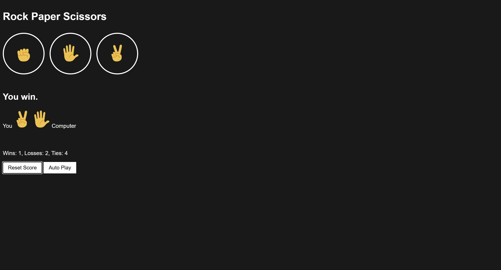

# Rock Paper Scissors Game

A beginner-friendly **Rock-Paper-Scissors** game built with **HTML**, **CSS**, and **JavaScript**.  
Features an autoplay toggle, persistent score tracking, and keyboard shortcuts.

## 🚀 Live Demo

[Play the Game](https://sreehari-07.github.io/rock-paper-scissors-game/)

## 📷 Preview

  

## Features

- Clickable move buttons and keyboard controls (`r` = Rock, `p` = Paper, `s` = Scissors)  
- **Autoplay mode**: starts automatic random plays; the same button toggles to **“Stop autoplay”**.  
- Autoplay **does not stop** when you play manually; you must click the button again to stop it.  
- Score tracking (wins/losses/ties) persisted using `localStorage`  
- Reset score button to clear history  
- Graceful image fallback if emoji assets fail to load  

## Tech Stack

- HTML5  
- CSS3  
- JavaScript (ES6)  
- Browser `localStorage`

## Project Structure

    rock-paper-scissors/
    ├── index.html
    ├── styles/
    │   └── rock-paper-scissors.css
    ├── scripts/
    │   └── rock-paper-scissors.js
    └── images/
        ├── rock-emoji.png
        ├── paper-emoji.png
        ├── scissors-emoji.png
        └── Screenshot.png

## How to Use

1. Click **Rock**, **Paper**, or **Scissors** (or press `R`, `P`, `S`) to play one round.  
2. Click **Auto Play** to start automatic random plays; button text switches to **Stop autoplay**.  
3. Manual plays do **not** interrupt autoplay.  
4. Click **Stop autoplay** to halt the automatic play.  
5. Click **Reset Score** to clear the stored results.

